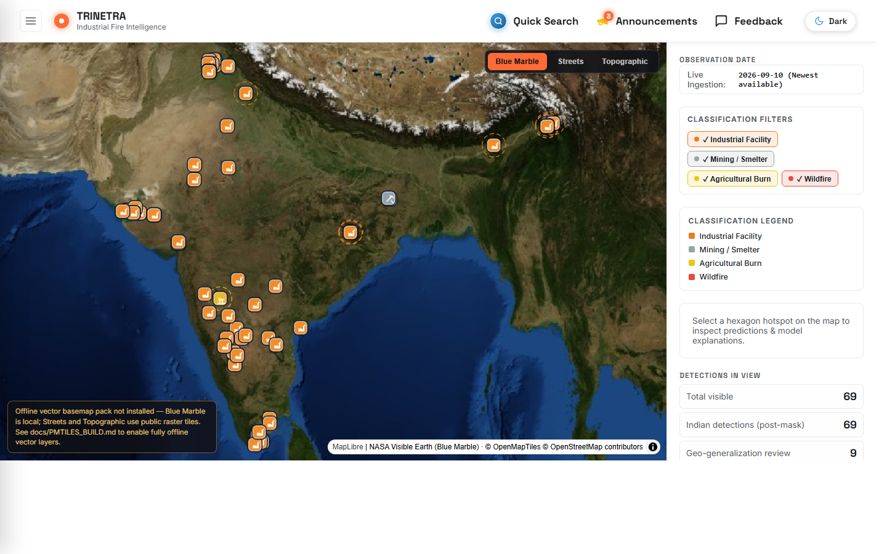
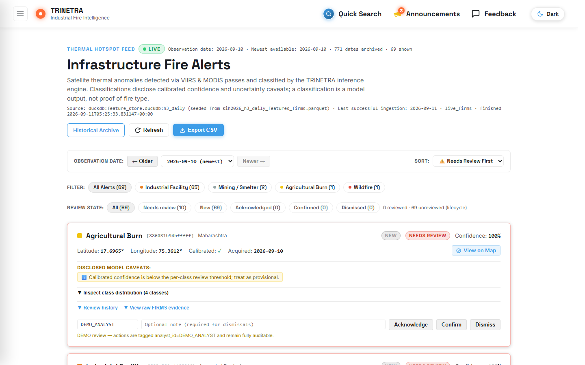
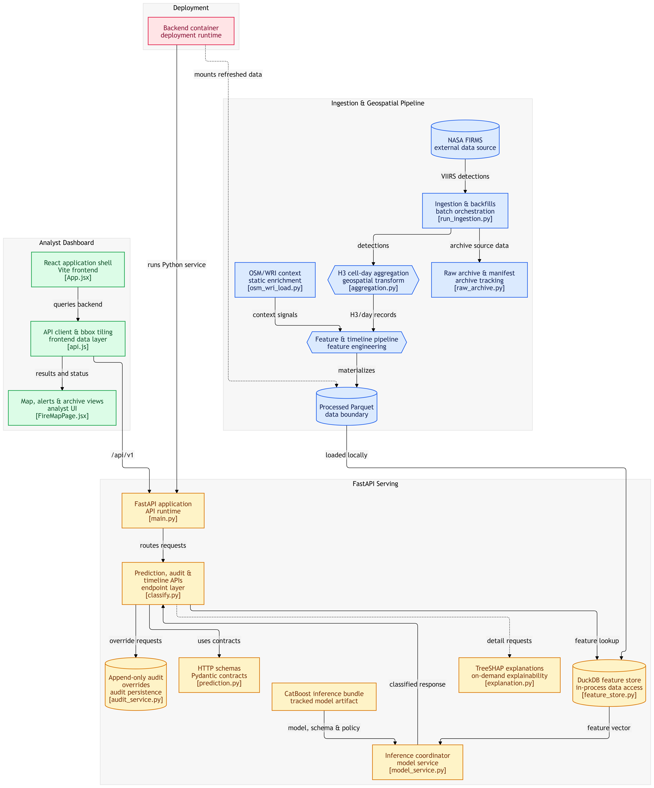

# 🛰️ PS26162 — Trinetra Fire Intelligence Platform (SIH 2026, NTRO)

[](LICENSE)

End-to-end platform that ingests NASA FIRMS (VIIRS) thermal hotspots across India,
classifies each H3 resolution-8 cell-day into one of four fire classes with a CatBoost
model, and serves the results to a MapLibre/Deck.gl dashboard with honest confidence
caveats and an analyst audit trail.

> **Client:** NTRO · **Problem statement:** SIH 2026, PS26162 · **Serving data:**
> nationwide archive backfill **in progress** as of 2026-09-20 — the pinned
> clone-and-run snapshot is the `serving-data-2026-09-09` release (see
> [`docs/RELEASES.md`](docs/RELEASES.md))
>
> Current-state reference: [`docs/CURRENT_PROJECT_TRUTH.md`](docs/CURRENT_PROJECT_TRUTH.md) ·
> Claim→evidence registry: [`docs/CLAIMS_AND_EVIDENCE.md`](docs/CLAIMS_AND_EVIDENCE.md) ·
> Backend API reference: [`BACKEND_DOCUMENTATION.md`](BACKEND_DOCUMENTATION.md) ·
> Frontend contract: [`FRONTEND_INTEGRATION_GUIDE.md`](FRONTEND_INTEGRATION_GUIDE.md) ·
> Judge demo: [`docs/HACKATHON_JUDGE_RUNBOOK.md`](docs/HACKATHON_JUDGE_RUNBOOK.md) ·
> Third-party attributions: [`THIRD_PARTY_NOTICES.md`](THIRD_PARTY_NOTICES.md)

Complete Windows clone-and-run guide, artifact inventory,
map/PMTiles setup, demo/live modes, and verification: [`docs/PROJECT_SETUP.md`](docs/PROJECT_SETUP.md).

---

## 1. What this is

| Layer | Tech | Role |
|---|---|---|
| **Ingestion** | `ingestion/` (FIRMS pull + OSM/WRI static merge) | Pull VIIRS detections, build cell-day features |
| **Backend** | FastAPI (`app/`) + DuckDB + CatBoost | Serve `/api/v1` predictions, timeline, SHAP, audit |
| **Model** | CatBoost multiclass (4 classes, 55 features, 2 categoricals) | Classify each `(h3_08, acq_date)` cell-day |
| **Frontend** | React 19 + Vite, MapLibre GL + Deck.gl + pmtiles | Interactive India fire map + honesty UI |

**Prediction unit:** one `(h3_08, acq_date)` cell-day — an H3 resolution-8 hexagon
(~0.7 km²) aggregated over one UTC acquisition date.

**Classes:** `industrial`, `mining`, `agricultural_burn`, `wildfire` — plus the
`unclassified` fallback: abstention is **on by default** (calibrated confidence
below 0.65 → `unclassified`; env `UNCLASSIFIED_THRESHOLD`, set it to
`off`/`none`/`false`/`0` to disable). It is not a fifth trained class.

**Model artifacts** live in `models/PS26162_catboost_final/inference_bundle/`
(the served contract — tracked in git):
`catboost_hotspot_classifier.cbm`, `calibrators.joblib`, `feature_schema.json`,
`review_thresholds.json`, `runtime_versions.json`.

**Derived (mechanical, not model output):** per-cell thermal regimes
(`persistent` / `new_anomaly` / `intermittent`) and thermal transition states,
computed from FIRMS history — kept strictly separate from model predictions
throughout the docs and UI.

## 2. The application

| Route | What it shows |
|---|---|
| `/home` | Overview dashboard |
| `/fire-map` | The main map: per-class detection layers, hex inspector, filters, legend |
| `/fire-alerts` | Analyst review workflow (alert lifecycle) |
| `/archive` | Historical archive browsing + provenance |
| `/announcements` | Product announcements |
| `/tutorial` | Guided usage walkthrough |

Mock/demo data mode is always visibly flagged (OfflineBanner), never silent.

| Fire map (desktop) | Analyst alert review (desktop) |
|---|---|
|  |  |

<sub>Screenshots captured 2026-09-10 on a local build; mobile layouts:
[`home`](docs/ppt-screenshots/mobile-home.png) ·
[`alerts`](docs/ppt-screenshots/mobile-fire-alerts.png).</sub>

## 3. Repository layout

```text
Trinetra-Fire-Intelligence-Platform/
├── app/                          # FastAPI backend (the /api/v1 service)
│   ├── api/endpoints/            # health, classify/predictions, archive, evidence, timeline, alerts, audit
│   ├── core/config.py            # Settings, MODEL_FEATURES, TARGET_CLASSES, paths
│   ├── schemas/                  # Pydantic request/response models
│   ├── services/                 # model_service, feature_store, explanation, thermal_regime, audit
│   └── main.py                   # App entrypoint
├── ingestion/                    # Live FIRMS pull + OSM/WRI static features + state assignment
├── pipeline/                     # H3 aggregation, feature engineering, timeline materialization, transitions
├── models/
│   └── PS26162_catboost_final/inference_bundle/   # .cbm + calibrators + thresholds (tracked)
├── data/                         # Runtime DuckDB + processed parquets (gitignored)
├── frontend/                     # Vite + React + MapLibre/Deck.gl dashboard
├── tests/                        # pytest suite (backend + data-plane)
├── notebooks/                    # EDA + training provenance
├── docs/                         # Current docs (docs/archive/ = historical research & process material)
├── Dockerfile / docker-compose.yml
├── requirements.txt / pyproject.toml / uv.lock
├── LICENSE (MIT) / THIRD_PARTY_NOTICES.md
└── AGENTS.md / AGENT_LOG.md / CONTRIBUTING.md
```

## 4. Architecture & data flow



```
NASA FIRMS (VIIRS) ──> ingestion/ ──> data/processed/*.parquet
                                          │ (DuckDB feature store, gitignored)
                                          ▼
                                    app/ (FastAPI) ── CatBoost inference ── TreeSHAP
                                          │  /api/v1/predictions · /health · /audit
                                          ▼
                        frontend/ (Vite · MapLibre + Deck.gl) ── analysts
```

- The backend seeds an in-process **DuckDB** feature store from processed parquets.
- SHAP is computed **on demand** per cell (CatBoost native TreeSHAP), never in list views.
- Audit overrides are append-only in `data/audit_log.duckdb`.
- Historical timeline layers are materialized under `data/processed/timeline/`
  by `pipeline/` (see `docs/superpowers/plans/2026-09-20-nationwide-archive-backfill.md`).

### Review thresholds (served from `inference_bundle/review_thresholds.json`)

| Class | Confidence threshold to be `needs_review=false` |
|---|---|
| `wildfire` | 0.70 |
| `industrial` | 0.70 |
| `mining` | 0.85 |
| `agricultural_burn` | 1.01 → **always `needs_review=true`** (mechanical) |

The backend fails loudly at startup if the configured `.cbm` does not match the
55-feature / 4-class contract; it never invents fallback predictions.

### Model performance & limits

Read these numbers with the caveat below — they are **not** ground-truth accuracy.

| Evaluation (macro-F1) | Score |
|---|---|
| Internal validation (H3-parent hash fold, zero H3 overlap) | 0.997 |
| Blind Test A (Gujarat, Tamil Nadu) | 0.974 |
| Blind Test B (Jharkhand, Rajasthan) | 0.994 |
| Ablated model (12 features removed, incl. `frp_max` and 8 OSM/WRI distance features) — Test A / Test B | 0.819 / 0.822 |

- **Labels are bootstrap/pseudo-labels** derived partly from the same FIRMS/OSM/WRI
  feature family the model consumes, so the scores above estimate how well the
  labeling scheme generalizes across states, not independent real-world accuracy.
  Always quote the headline scores together with the ablated ones.
- Test A/B states were consumed only after the final refit (no tuning, early
  stopping, feature or threshold selection on them).
- Thin classes: `mining` (4,886) and `agricultural_burn` (1,762) of 58,911
  validation rows. `agricultural_burn` is always routed to analyst review.
- Isotonic calibration saturates confidences (most cells land at 0 or 1), so
  confidence is not a fine-grained uncertainty signal.
- Source of truth and evidence per claim: `models/PS26162_catboost_final/model_metadata.json`
  and [`docs/CLAIMS_AND_EVIDENCE.md`](docs/CLAIMS_AND_EVIDENCE.md) (C-10 – C-13).

## 5. Supported environments

| Path | Status |
|---|---|
| **Windows + PowerShell + Python 3.12 + Node** | Primary development/demo path (see `docs/PROJECT_SETUP.md`) |
| **Docker** (`docker compose up backend`) | Canonical container path; builds from a fresh clone (degraded data mode until data is fetched) |
| Linux/macOS via the bash tooling (`run-demo.sh`) | Supported for the API + dev server; PMTiles guide includes both bash and PowerShell commands |

Prerequisites:

- **Python 3.12** (see [`.python-version`](.python-version))
- **Node.js 20.19+ / 22+** (required by Vite 8)
- Docker (optional — container path)
- A **NASA FIRMS map key** (free Tier-1): https://firms.modaps.eosdis.nasa.gov/api/area/

## 6. Quick start

### Suggested reading order

Problem → architecture → run it → data → model → API → reproduce artifacts → limitations:

1. This README → 2. [`docs/architecture.md`](docs/architecture.md) →
3. [`docs/PROJECT_SETUP.md`](docs/PROJECT_SETUP.md) → 4. [`data/README.md`](data/README.md) +
   [`docs/RELEASES.md`](docs/RELEASES.md) → 5. [`models/README.md`](models/README.md) +
   [`docs/CLAIMS_AND_EVIDENCE.md`](docs/CLAIMS_AND_EVIDENCE.md) →
6. [`docs/API_REFERENCE.md`](docs/API_REFERENCE.md) → 7. [`docs/CURRENT_PROJECT_TRUTH.md`](docs/CURRENT_PROJECT_TRUTH.md) (canonical current state) → 8. `docs/WHOLE_SYSTEM_AUDIT.md` + `docs/CURRENT_PROJECT_TRUTH.md` §21 (limitations and known risks)

### Environment setup

Copy the template and add your keys:

```powershell
copy .env.example .env
# edit .env — set FIRMS_MAP_KEY
```

`.env` is gitignored. `.env.example` documents every variable the pipeline/backend
reads (notably `FIRMS_MAP_KEY`, not `FIRMS_API_KEY`) and matches the real names —
including `VITE_API_URL` for the frontend (no `/api/v1` suffix; the SPA appends it).

## 7. Backend — run it

```powershell
python -m venv .venv
.\.venv\Scripts\Activate.ps1
pip install -r requirements.txt

# 1) Contract + data-plane tests (avoids hitting the live FIRMS API).
#    Green on a fresh clone (data-backed tests skip with a reason); run
#    scripts/fetch_serving_data.py first to execute them too.
python -m pytest -m "not live"

# 2) Live-ingestion smoke tests (burns FIRMS transactions — opt-in)
python -m pytest -m live

# 3) Start the API
uvicorn app.main:app --host 0.0.0.0 --port 8000
```

- Swagger UI: http://localhost:8000/docs
- Health check: http://localhost:8000/health

### Serving data requirements

Before the API returns predictions you need the two processed parquets (gitignored) at
`data/processed/`:
`data/processed/sih2026_h3_daily_features_firms.parquet`
`data/processed/sih2026_h3_daily_features_with_osm_wri.parquet`

On a fresh clone, fetch the pinned release snapshot (SHA256-verified):

```powershell
python scripts/fetch_serving_data.py
```

or produce them with `ingestion/` from a FIRMS pull. Without them the backend boots
**degraded and fail-closed**: `/health` returns HTTP 200 with `status: "degraded"`,
`database: "unavailable"` and the reason in `database_detail`; prediction, archive and
alert routes answer **503** (never invented data) and recover as soon as the parquets
appear. The frontend then runs in mock/demo mode — visibly flagged (OfflineBanner),
never silent.

Pinned snapshot `serving-data-2026-09-09` (measured 2026-09-20): 813,789 cell-days over
463,127 H3-8 cells, acquisition dates 2024-08-01 → 2026-09-08, detections in 10 states
(the 6 training + 4 blind-test states). The nationwide refresh is pending — see
[`docs/RELEASES.md`](docs/RELEASES.md).

## 8. Frontend — run it

```powershell
cd frontend
npm ci
npm run dev        # Vite dev server (default :5173)
```

- `npm run lint` — oxlint
- `npm run build` — production build
- `npm run preview` — serve the production build
- The frontend expects the backend at `http://localhost:8000/api/v1` — set
  `VITE_API_URL` (base only) in `frontend/.env` if you run it elsewhere.

Frontend notes:
- The map is **MapLibre GL** via `react-map-gl/maplibre` with **deck.gl**
  per-class detection icon layers via `@deck.gl/mapbox` `MapboxOverlay`,
  `h3-js` v4.5.0, and basemaps documented per-mode in
  [`docs/PMTILES_BUILD.md`](docs/PMTILES_BUILD.md): Blue Marble (NASA GIBS,
  remote, zoom ≤ 8), Satellite HD (Esri, remote, zoom 19), and the fully
  offline Streets/Topo vector styles enabled by the local PMTiles archive.
- `frontend/src/services/api.js` implements the full contract: 2500-cap 2×2 bbox tiling,
  `CORS` via config defaults, `unclassified` shown only when the batch actually contains
  it, and backend `caveat_flag` text rendered verbatim (never a fabricated accuracy number).

## 9. Docker — run it

```powershell
docker compose up backend        # builds + boots the API on :8000
# or
docker build -t sih2026-backend .
```

- The build is **self-contained from a fresh clone**: without the serving
  parquets it produces a degraded-mode image (API boots, `/health` reports
  `status: "degraded"` / `database: "unavailable"`, data routes return 503) — run `python scripts/fetch_serving_data.py` first to bake in
  real data.
- The image bakes in `models/PS26162_catboost_final/inference_bundle/` and, when
  present, the processed parquets, and on first boot seeds a writable volume. A
  `./app:/app/app` mount gives dev-mode reload; `./data/processed:/data:ro` lets
  fresh host parquets shadow the baked ones.
- The compose file has a single `backend` service (legacy Postgres/Redis/ml-worker services
  were removed in the 2026-09-02 cleanup).

## 10. API summary

Base path `http://localhost:8000/api/v1` (root prediction aliases also exposed without the prefix).
Full route-by-route reference: [`docs/API_REFERENCE.md`](docs/API_REFERENCE.md).

| Endpoint | Purpose |
| :--- | :--- |
| `GET /health` | Model load state, schema version/hash, artifact path, target classes |
| `GET /predictions?min_lat&max_lat&min_lon&max_lon&acq_date` | Cell-day predictions in a bbox (cap 2500 → tile client-side) |
| `GET /predictions/{cell_id}?acq_date=` | One cell: class, confidence, probabilities, context |
| `GET /predictions/{cell_id}/explain?acq_date=` | On-demand TreeSHAP, top-3 drivers |
| `POST /audit/override` · `GET /audit/logs` | Analyst override + audit retrieval |

Example `PredictionResponse` (detail):

```json
{
  "cell_id": "88209a2011fffff",
  "latitude": 34.353099,
  "longitude": 73.794692,
  "h3_index": "88209a2011fffff",
  "predicted_class": "wildfire",
  "probabilities": [
    { "class_name": "agricultural_burn", "probability": 0.01 },
    { "class_name": "industrial", "probability": 0.02 },
    { "class_name": "mining", "probability": 0.03 },
    { "class_name": "wildfire", "probability": 0.94 }
  ],
  "confidence": 0.94,
  "calibrated": true,
  "needs_review": false,
  "caveat_flag": null,
  "latency_ms": 8.2
}
```

One `acq_date` per request (no date ranges); `zoom` optional (default 8, range 1–20).

## 11. Tests & CI

```powershell
python -m pytest -m "not live"   # default addopts — offline suite
python -m pytest -m live         # live FIRMS calls (opt-in, burns transactions)
```

`pyproject.toml` sets `addopts = "-m 'not live'"` so the offline suite is the default
and live API calls are an explicit marker. Latest verification counts live in
[`AGENT_LOG.md`](AGENT_LOG.md) (re-run with every meaningful change).

There is **no frontend test script** — `lint` and `build` are the verification
hooks. CI (`.github/workflows/`): backend pytest + notebook-strip check (`test.yml`),
Ruff + advisory mypy on Python 3.12 (`lint.yml`), frontend oxlint + build
(`frontend.yml`), and a fresh-clone Docker build + `/health` smoke run (`docker.yml`).

## 12. Contributing & agent conventions

- [`CONTRIBUTING.md`](CONTRIBUTING.md) — contribution workflow.
- [`AGENTS.md`](AGENTS.md) / [`CLAUDE.md`](CLAUDE.md) — shared agent context
  (locked taxonomy, logging protocol); historical per-agent briefs are in
  [`docs/archive/internal/`](docs/archive/internal/).
- [`AGENT_LOG.md`](AGENT_LOG.md) — append-only change log (read it before commits).
- [`docs/README.md`](docs/README.md) — the documentation map (current docs vs
  [`docs/archive/`](docs/archive/README.md)).

## 13. Git & artifacts

- Secrets (`.env`), runtime DBs (`*.duckdb*`), processed/source parquets, and raw model
  outputs are **gitignored** — never commit them.
- The **served model bundle** `models/PS26162_catboost_final/inference_bundle/` IS tracked
  (it is the deployed contract).
- Everything else large (serving snapshots, the PMTiles basemap, timeline layers)
  is distributed via **GitHub Releases** — policy and current status:
  [`docs/RELEASES.md`](docs/RELEASES.md). To reproduce serving data from scratch,
  run the ingestion pipeline inside `ingestion/`.

## 14. License & attribution

Distributed under the [MIT License](LICENSE). Third-party data, tiles, fonts, and
libraries keep their own licenses — sources and required attributions are listed in
[THIRD_PARTY_NOTICES.md](THIRD_PARTY_NOTICES.md) (NASA FIRMS/GIBS, OpenStreetMap/Geofabrik,
Esri, Mapzen/AWS terrain, WRI, Noto Sans, Inter, and the main JS/Python dependencies).
