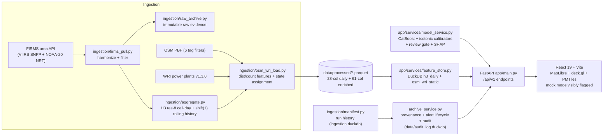

# Current Project Truth — PS26162 (Trinetra Fire Intelligence Platform)

> **STATUS: CANONICAL — this is the authoritative current-state reference.**
> Every factual claim here carries a registry ID (`C-xx`) pointing to
> [`CLAIMS_AND_EVIDENCE.md`](CLAIMS_AND_EVIDENCE.md), which cites the exact
> artifact, code path, or executed verification. If any other document
> contradicts this one, this one wins — or both are wrong and the registry is
> the tiebreaker.
>
> **Last verified:** 2026-09-10 on the current checkout.

## 1. Project Identity

Team project for Smart India Hackathon 2026, problem statement PS26162 /
SIH26162 (recorded project context: Software category, submission window
closes 20 Sep 2026) [C-32]. Internal product name: **Trinetra Fire
Intelligence Platform**. Repository: `dptel22/SIH_2026`, branch `main`.

## 2. Official Problem Statement

**UNKNOWN — the verbatim official problem statement text is not present in
the repository** [C-31]. `docs/problem-statement.md` previously contained an
unfilled placeholder. The only in-repo sources are the team's own concept note
(`docs/decisions/SIH26162_Project_Document.docx`) and one-line summaries in
README/AGENTS.md — both are our interpretation, not the official text.
Establishing it requires the official SIH 2026 PS26162 page/portal text pasted
verbatim into `docs/problem-statement.md`. Until then, no document may quote
"official" requirements.

## 3. Current Product Definition

A working full-stack system that ingests NASA FIRMS VIIRS active-fire
detections for India, aggregates them to one prediction per `(h3_08,
acq_date)` cell-day, fuses static OSM/WRI context features, and classifies
each cell-day into one of four fire classes with a calibrated CatBoost model
[C-01, C-05, C-14]. A FastAPI backend serves predictions, on-demand SHAP
explanations, a historical archive with provenance labels, an analyst
alert-review lifecycle, and an append-only audit trail [C-20, C-22, C-36].
A React/MapLibre/deck.gl frontend renders the map with honesty machinery:
visible mock-mode banners, verbatim backend caveats, and no fabricated
confidence claims [C-25, C-27].

**What an analyst can actually do today:** browse an India map for a chosen
UTC date, filter by class, click a cell to see class probabilities,
calibration state, review requirement, full feature context, and top-3 SHAP
drivers; review flagged predictions in an alert queue with
acknowledge/confirm/dismiss/reopen actions and append-only history; export
CSVs; inspect the raw FIRMS evidence behind any run.

## 4. Users / Operational Workflow

Intended user: an analyst reviewing thermal anomalies for industrial/mining
activity. Implemented workflow: ingest → classify → surface with caveats →
analyst review (alert lifecycle) → audit override trail. There are **no
deployed users, pilots, or operational deployments** — this is a hackathon
prototype validated by tests and local runs only [C-33].

## 5. Current Architecture

Every box above is a real component in the repo; every arrow is a real data
flow [C-20, C-21, C-36]. Historical components (PostgreSQL/PostGIS, Redis,
WebSocket, ml-worker, point-level XGBoost demo) were removed in the
2026-09-02 cleanup and appear nowhere in the running system [C-21, C-34].

## 6. Data Sources

| Source | Actually used | Role | Notes |
|---|---|---|---|
| NASA FIRMS VIIRS SNPP NRT | Yes — training corpus + live serving | Primary detections | Only SNPP + NOAA-20 sources in code; 5-day request ceiling [C-15] |
| NASA FIRMS VIIRS NOAA-20 NRT | Yes | Primary detections | Same pipeline [C-15] |
| MODIS / NOAA-21 | **No** | — | Not ingested anywhere [C-15] |
| OSM India PBF (~1.7 GB) | Yes | Static enrichment | 6 tag filters; distances + counts within 5 km [C-16] |
| WRI Global Power Plant DB v1.3.0 | Yes | Static enrichment | India rows; per-fuel distance + count within 10 km [C-16] |
| Pinned India state shapefile | Yes | Geography labeling | Hash-verified commit; point-in-polygon + nearest-boundary tie-break [C-16] |

## 7. Data Pipeline

1. **Pull & harmonize** (`ingestion/firms_pull.py`): FIRMS area API, SSRF
   hardened; confidence "low" dropped; dedup; physical sanity gates [C-15].
2. **Raw archive** (`ingestion/raw_archive.py`): immutable hive-style parquet
   parts written **before** harmonization — rejected rows retained [C-36].
3. **Aggregate** (`ingestion/aggregate.py`): H3 res-8, one row per
   `(h3_08, acq_date)` UTC; shift(1) **before** 7d/30d/90d rolling so the
   current day never leaks into its own history (test-enforced) [C-14, C-17].
4. **Enrich** (`ingestion/osm_wri_load.py`): OSM/WRI distance/count features,
   state assignment, India land-mask gate; calendar features (`acq_month`,
   `doy_sin`, `doy_cos`) derived in DuckDB SQL at seed time [C-16].
5. **Serve** (`app/services/feature_store.py`): DuckDB seeded from the 28-col
   daily and 61-col enriched parquets; atomic two-table swap under one lock;
   static staging filtered to valid assignment methods (GEO-001 fix) [C-19].

## 8. Prediction Unit

One `(h3_08, acq_date)` cell-day at **H3 resolution 8** (~0.7 km²), one UTC
acquisition date per request. The `zoom` query parameter is echoed but
decorative — cells are always returned at native res 8 [C-14].

## 9. Model Contract

CatBoost multiclass; artifact
`models/PS26162_catboost_final/inference_bundle/catboost_hotspot_classifier.cbm`
with tracked calibrators/schema/thresholds/runtime files [C-01, C-02].
**55 features** in a fixed order, enforced three-way at startup (fail-closed)
[C-03]. Categoricals: `h3_08`, `daynight` [C-04]. Best iteration 116,
`auto_class_weights=Balanced`, dataset sha256 `fbdd86cb…39333`
(`model_metadata.json`). Schema version `v3-h3-day-catboost`; backend v2.0.0.

## 10. Features

55 features: 27 H3-day detection/aggregation columns (FRP, brightness,
detections, saturation, scan/track, confidence, day/night splits,
`satellite_nunique`, lag/rolling history `*_lag7/lag30`, `active_days_7d/30d/90d`,
calendar `acq_month`/`doy_sin`/`doy_cos`, `is_first_observation`), then 16
WRI columns (interleaved `dist_wri_{fuel}_km` / `n_wri_{fuel}_10km` for 8
fuels), then 12 OSM columns (interleaved for industrial/quarry/farmland/
mineshaft/adit/power_infra). Exact ordered list:
`app/core/config.py:15-71` / `feature_schema.json`. Only `satellite_nunique`
is modeled — raw satellite identity is not a feature (recorded honestly in
`model_metadata.json` `satellite_feature_status`) [C-15].

## 11. Target Classes

Four trained classes: `industrial`, `mining`, `agricultural_burn`, `wildfire`
[C-05]. Class colors in the UI: `#E67E22`, `#95A5A6`, `#F1C40F`, `#E74C3C`;
`unclassified` fallback `#787878` [C-06, C-27]. There is **no** fifth trained
class and no risk-tier taxonomy — `high_risk`/`medium_risk`/`low_risk`/
`no_fire` vocabulary belongs to a superseded era [C-34].

## 12. Calibration / Confidence / Abstention

Per-class one-vs-rest isotonic regression, renormalized; `calibrated` reports
per-row success [C-08]. `confidence` is the calibrated max class probability —
a model output, never an accuracy claim. Review gate (raw class): wildfire
0.70 / industrial 0.70 / mining 0.85 / agricultural_burn 1.01 — so
agricultural_burn is mechanically always `needs_review=true` [C-07]. Cells
outside the training geography are also force-flagged for review [C-18
remediation note]. Abstention (`unclassified`) is env-gated and OFF by
default [C-06].

## 13. Explainability

CatBoost-native SHAP, computed on demand per cell (never in list views),
served as top-3 attributions + base value + humanized names + persistence
classification (`is_static_land`, `active_days_*`) + mining subtype from OSM
proximity [C-09]. Null-safety hardened per the 2026-09-10 review (AGENT_LOG).

## 14. Backend

FastAPI + uvicorn; lifespan loads feature store, loads model **fail-closed**,
then optionally starts a freshness-driven FIRMS ingestion daemon thread
(disable with `INGESTION_ON_STARTUP=0`) [C-20]. Endpoints [C-22]:
`GET /health`; `GET /predictions` (bbox + one `acq_date`, server-side
`LIMIT 2500`, no cursor — clients tile); cell detail; cell explain; root
aliases; and under `/api/v1`: `classify`/`classify/batch`/`explain`,
archive (`dates`, `predictions`, `summary` ≤31 days, `runs`, `evidence`),
alerts (`actions`, `states`, `history`), audit (`override`, `logs`).
Storage: **DuckDB (3 files) + Parquet only**; no Postgres/Redis/WebSocket
[C-21].

## 15. Frontend

React 19 + Vite; MapLibre GL via `react-map-gl/maplibre` + deck.gl layers via
`MapboxOverlay` + PMTiles protocol + h3-js v4.5.0 [C-25]. Pages: splash, home,
fire map, fire alerts (analyst review), archive. Honesty machinery: mock rows
carry `is_synthetic: true` + OfflineBanner + "SIMULATED" labels; LIVE/
HISTORICAL/DEMO/OFFLINE status pills; strict endpoints throw rather than mock
[C-27]. Shipped basemap: Blue Marble raster tiles; the vector PMTiles pack is
optional and currently **not built** in this checkout [C-26]. Known wart:
code reads `VITE_API_URL` while `.env.example` documents `VITE_API_BASE_URL`
— the default (`http://localhost:8000`) works, but the env-var name mismatch
is real and unresolved.

## 16. Demo Mode

Frontend mock mode: curated real-place centers expanded via H3 grid disks,
every row visibly synthetic; used only when the live backend is unreachable
[C-27]. The judge path is `docs/HACKATHON_JUDGE_RUNBOOK.md` (`setup.ps1 -Mode
demo`, `verify.ps1`, dev server) [C-29]. The old `docs/demo-script.md` is
deprecated [C-34].

## 17. Live Mode

Live ingestion requires `FIRMS_MAP_KEY`, the India OSM PBF, the WRI CSV, and
the pinned boundary files (runbook "Live mode prerequisite"). Provenance
labels (`live`/`historical`/`offline`/`failed`/`plausibility_warning`/
`no_run_record`) come from the run manifest — nothing fabricates freshness
[C-36]. One live-marked pytest exists, deselected by default [C-23].

## 18. Deployment

Single Docker backend (python:3.12-slim; bundle + parquets baked; writable
volume seeded on boot); compose runs one `backend` service; no frontend image
[C-28]. Verified 2026-09-10 per AGENT_LOG: Docker build + container health
check passed; live ingestion does not run inside the slim image (raw inputs
not copied in).

## 19. Validation

Verified 2026-09-10 on this checkout [C-23, C-24, C-35]:
- Backend pytest: **135 passed, 1 deselected**, 2 known deprecation warnings.
- Frontend: oxlint 0/0; production build passes. No frontend unit-test script.
- Training/serving parity is an enforced test (order + per-value, real
  serving-key intersections).
- Docker build + Compose boot verified per AGENT_LOG 2026-09-10.

## 20. Known Limitations

1. **Pseudo-label circularity** [C-10]: labels derive partly from the same
   FIRMS/OSM/WRI features the model consumes; metrics estimate labeling-scheme
   generalization, not ground-truth accuracy.
2. **Coverage ≠ nationwide** [C-18]: inference is all-India by design, but the
   current artifact covers the 20 states/UTs with ingested detections;
   states without cells are an ingestion gap, not a serving filter.
3. **Thin classes** [C-12]: mining (4,886) and agricultural_burn (1,762)
   validation rows are scarce; ag-burn is always routed to review [C-07].
4. **No independent ground truth**; no field validation of any prediction.
5. **Vector PMTiles basemap not built** in this checkout [C-26].
6. **`VITE_API_URL` / `VITE_API_BASE_URL` env-name mismatch** (works only via
   the localhost default).
7. **No frontend unit tests**; CI covers backend lint/tests only [C-24].
8. **Legacy GEO-001 defect**: a prior artifact labeled 3,051 outside-India
   rows as Tamil Nadu; fixed in store staging and absent from the current
   artifact [C-19].

## 21. Known Risks

Judges may probe: pseudo-label validity (C-10), coverage claims (C-18),
calibration trustworthiness outside training geography, single-model
abstention default-off (C-06), and demo reproducibility on a fresh machine
(C-29: runbook inputs verified present, but a full fresh-setup run was not
re-executed today).

## 22. Current Implementation Status

| Capability | Status |
|---|---|
| Ingestion (FIRMS SNPP+NOAA-20, OSM, WRI, states, raw archive) | IMPLEMENTED [C-15, C-16, C-36] |
| H3-8 cell-day aggregation + leakage-safe history | IMPLEMENTED [C-14, C-17] |
| CatBoost model + calibration + thresholds + SHAP | IMPLEMENTED [C-01–C-09] |
| Backend API incl. archive/alerts/audit | IMPLEMENTED [C-20–C-22] |
| Frontend map + honesty UI + alerts + archive | IMPLEMENTED [C-25–C-27] |
| Mock/demo mode (visibly flagged) | IMPLEMENTED [C-27] |
| Vector PMTiles offline basemap | PARTIALLY IMPLEMENTED (build doc + deps ready; archive absent) [C-26] |
| Nationwide-dense serving artifact | PARTIALLY IMPLEMENTED (pipeline all-India; artifact has 20 states/UTs) [C-18] |
| Automated retraining / MLOps | NOT IMPLEMENTED (no training-at-startup, by design) [C-20] |
| Multi-user/auth, scale-out serving | NOT IMPLEMENTED |
| Official problem-statement text | UNKNOWN [C-31] |

## 23. Deferred / Planned Work

Regenerate/extend the serving artifact toward full-India ingestion coverage;
build the optional PMTiles pack; unify the `VITE_API_*` env name; a fresh
full-machine demo verification run; paste the verbatim official PS text;
frontend test suite; Docker image CI.

## 24. Evidence Sources

Primary: git-tracked bundle JSONs + `.cbm` (`models/PS26162_catboost_final/`),
`app/`, `ingestion/` code, `tests/` (135 passed 2026-09-10), serving parquets
(read directly 2026-09-10), `AGENT_LOG.md` latest entries. Registries:
[`CLAIMS_AND_EVIDENCE.md`](CLAIMS_AND_EVIDENCE.md) (claim→evidence map),
[`docs/README.md`](README.md) (document hierarchy).

## 25. Historical Changes (model-contract evolution)

1. **Era 0 (~2026-08-28, planning):** XGBoost, H3 res 7, 4 risk tiers
   (`high/medium/low/no_fire`), Postgres/Redis/WebSocket planned. Superseded —
   never shipped [C-34].
2. **Era 1 (~2026-09-01/02, research):** CatBoost selected; a 14-feature
   synthetic point-level demo was exposed as a defect and removed; 52-feature
   H3-day contract established; Postgres/Redis removed 2026-09-02 [C-21].
3. **Era 2 (2026-09-08, current):** 55-feature contract locked (adds
   `acq_month`, `doy_sin`, `doy_cos`); parity tests added; sklearn 1.6.1
   pinned; live FIRMS ingestion landed.
4. **Era 3 (2026-09-09/10, current serving):** live bench run; raw evidence
   archive + run manifests + alert lifecycle; adversarial audit (GEO-001,
   DATA-001/002, MODEL-001, TEST-001, API-001) found and remediated;
   all-India refresh → 20 states/UTs serving artifact, zero outside-India
   cells, 135-test suite green [C-18, C-19, C-23].
