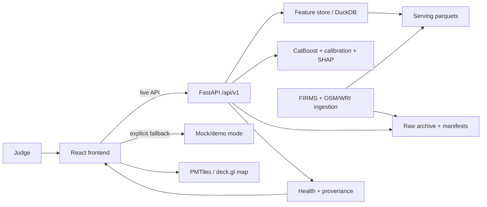

# Whole-System Adversarial Hackathon Audit

> Reading note (2026-09-11): the findings table below records the
> **pre-remediation** state (what the audit found); the executive summary
> describes the post-refresh state; the fixes live in the working tree and are
> verified by the 2026-09-10/11 test runs (137 passed, 1 deselected — see
> `docs/CLAIMS_AND_EVIDENCE.md` C-18/C-19/C-23). Current-state reference:
> `docs/CURRENT_PROJECT_TRUTH.md`.

Audit date: 2026-09-10  
Scope: frontend, backend, model serving, ingestion, data plane, operations, and documentation  
Priority: a truthful, repeatable judge-facing demo

## Executive status

The current checkout has a verified demo path: backend **137 passed, 1
deselected, 2 known upstream compatibility warnings**; frontend lint passes;
frontend production build passes; Docker health passes; and the browser
walkthrough has no actionable console errors.

The main risks are not cosmetic. Before the refresh, the serving artifact
contained cells outside India labeled as Tamil Nadu and covered only the
original ten training states. The all-India refresh on 2026-09-10 now serves
20 Indian states/UTs represented by the FIRMS data, rejects 4,113 outside-India
rows, and reports 44 rows outside the model's training geography for analyst
review. It covers every available acquisition date from 2024-08-01 through
2026-09-10; it does not claim detections in states with no satellite rows.

## Judge-facing system map



## Findings

### P0 — demo truth and correctness

| ID | Finding | Evidence | Status |
|---|---|---|---|
| GEO-001 | Invalid legacy geography could reach viewport predictions. | Stale rows used `nearest_unmatched` and included Sri Lanka-like coordinates. | Fixed: runtime filters invalid assignments, ingestion revalidates carried-over cells, and the refreshed artifact has zero outside-India rows. |
| DATA-001 | Serving artifact previously covered only ten training states. | 2026-09-10 refresh now serves 20 states/UTs represented by FIRMS detections across 771 dates. | Fixed for observed data; states with no satellite detections remain explicitly empty. |
| MODEL-001 | Selected training parity cases were absent from serving data. | Parity fixtures selected hard-coded cells outside the refreshed serving intersection. | Fixed: fixtures select real training/serving intersections. |
| DATA-002 | Static parquet order differed from the locked writer order. | Writer and test used different WRI/OSM grouping assumptions. | Fixed: the locked test consumes the writer's canonical column order. |
| TEST-001 | Windows pytest temp permissions caused collection errors. | Shared temp-root access was denied. | Fixed: tests use an isolated suite temp directory. |
| API-001 | Archive summary test expected an unbounded range despite the 31-day contract. | The frontend already sends bounded requests. | Fixed: test now exercises the documented bounded contract. |

### P1 — credibility and resilience

- Health and archive provenance must distinguish live, historical, demo, offline,
  failed, and implausibly empty runs without relying on old history entries.
- Demo fallback must remain visibly labeled and must not substitute mock detail
  or alert actions for unavailable live endpoints.
- Model bundle, feature order, H3 resolution, review thresholds, calibration,
  and explanation shape need one current contract check.
- Docker and Compose need a fresh startup check because volume shadowing can
  produce a different dataset from the host run.
- Browser verification must cover map assets, empty results, stale selection
  clearing, narrow layout, and console/network errors.

### P2 — simplification candidates

delete: stale legacy demo documentation that still describes removed XGBoost/Postgres paths; replace with one current judge walkthrough. [docs/demo-script.md]

delete: unused frontend `fetchArchiveRuns` import. [frontend/src/components/FireAlertsPage.jsx]

shrink: duplicate demo/live status rendering where the shared status component already exists. [frontend/src/components/ArchivePage.jsx, frontend/src/components/FireAlertsPage.jsx]

yagni: any new monitoring, abstraction, or dependency that does not protect the judge-facing path. [repository-wide]

## Verification commands and results

Baseline commands:

```powershell
.\.venv\Scripts\python.exe -m pytest -p no:cacheprovider
Push-Location frontend; npm run lint; npm run build; Pop-Location
```

Current result: backend suite reaches 137 passed, 1 deselected, with two known
Starlette/httpx and anyio compatibility warnings. Frontend lint passes and the
production build uses route-level chunks; the map vendor chunks remain large by
design but the application entry and route chunks are below the warning ceiling.
The current build measured an application entry of approximately 302 KB, a map
route of approximately 58 KB, an alerts route of approximately 34 KB, and an
archive route of approximately 21 KB. MapLibre and deck.gl remain isolated
vendor chunks because replacing the locked map stack is outside this cleanup.

Required final gates:

- Backend tests in an isolated Windows-safe temp directory.
- Frontend lint with zero actionable warnings.
- Frontend production build.
- API smoke checks against a running backend.
- Docker build and Compose startup.
- Browser judge walkthrough with no actionable console/network errors.
- Live FIRMS smoke only when credentials and raw OSM/WRI/boundary inputs exist.

Known non-actionable warnings: the pinned environment currently reports the
Starlette TestClient/httpx compatibility warning (`fastapi 0.141.1`,
`starlette 1.6.0`, `httpx 0.28.1`) and the anyio BlockingPortal deprecation.
They are documented rather than hidden or “fixed” through an unverified
dependency migration.

## Honest limitations

The serving artifact proves all-India-bbox inference for observed FIRMS data,
not a detection in every state on every date. States without satellite rows are
not fabricated. Docker demo startup is independent of live ingestion; live
ingestion requires mounted raw inputs and a host-provided FIRMS key.

## Change log

This report is the first current-state audit record. Remediation entries belong
in the append-only root `AGENT_LOG.md` after each meaningful change.
