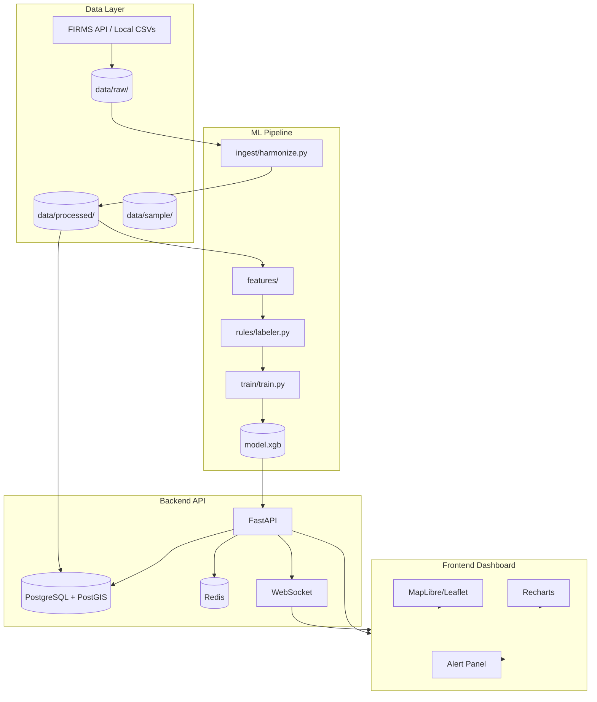

# Architecture — SIH 2026 PS26162

## System Overview



## Data Flow

1. **Ingestion** (scheduled/daily):
   - FIRMS API fetch → local CSV fallback
   - Schema harmonization across sources
   - Output: `data/processed/fires_harmonized.parquet`

2. **Feature Engineering**:
   - H3 indexing (res 7, 8)
   - Persistence_90d: fire count in 90-day window per H3 cell
   - History_days: days with fires in cell
   - Temporal: cyclical encoding of day-of-year, hour

3. **Rule-Based Labeling**:
   - Threshold cascade → risk labels
   - Output: labeled dataset for training

4. **Training** (scheduled/daily):
   - Temporal train/val split
   - XGBoost with early stopping
   - Artifacts: model.xgb, metrics.json, feature_importance.csv

5. **Serving**:
   - FastAPI loads model at startup
   - REST endpoints for fires, predictions, model info
   - WebSocket for real-time alerts

6. **Frontend**:
   - Map: fire points (clustered), H3 choropleth
   - Time slider animation
   - Alert feed with WebSocket updates

## Technology Choices (Locked)

| Component | Choice | Rationale |
|-----------|--------|-----------|
| ML Model | XGBoost | Tabular champion, fast inference, handles imbalance |
| Spatial Index | H3 (res 7, 8) | Hierarchical, equal-area, fast neighbor queries |
| Data Format | Parquet | Columnar, compressed, fast analytical queries |
| API Framework | FastAPI | Async, OpenAPI, type-safe, fast |
| Map Library | TBD | MapLibre for vector tiles / Leaflet for simplicity |
| Database | TBD | PostgreSQL+PostGIS vs SQLite+SpatiaLite |

## Deployment Topology

```
┌─────────────────────────────────────┐
│         docker-compose.yml          │
├─────────────┬───────────┬───────────┤
│  Postgres   │   Redis   │  Backend  │
│  (PostGIS)  │           │  (FastAPI)│
├─────────────┴───────────┴───────────┤
│           Frontend (Vite)           │
└─────────────────────────────────────┘
```

## Scaling Considerations
- **1.19M rows** → Parquet + columnar reads = fast
- **H3 resolution 7** → ~1.2km hexagons, ~50K cells for India
- **Model inference** → < 1ms per prediction batch
- **Map rendering** → Server-side clustering + vector tiles for >100K points